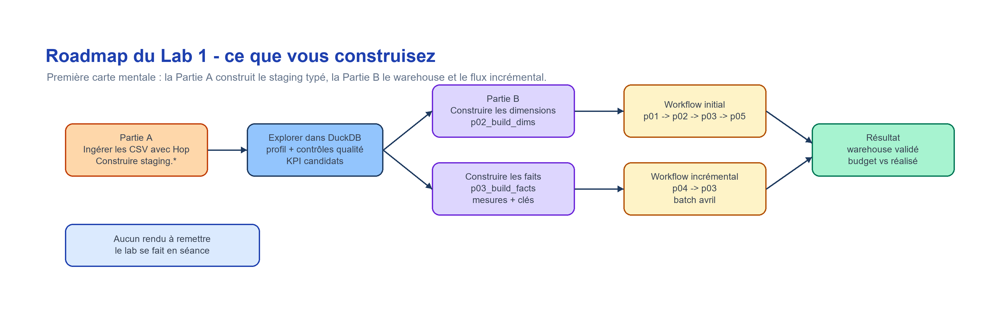
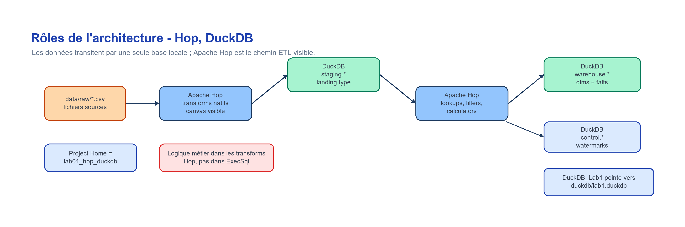

# Lab 1 — Ingestion GUI + exploration locale avec DuckDB

**Contexte :** premier lab du cours BI, à réaliser après les séances 1 et 2.  
**Outils :** Apache Hop + DuckDB CLI  
**Durée indicative :** ~3h pour la partie A, ~3h pour la partie B (même lab, d'une traite)  
**dbt :** non utilisé dans ce lab

## Objectif pédagogique

Comprendre les données avant de modéliser. Le but de la partie A est de charger des sources,
explorer leur qualité, distinguer données opérationnelles et données analytiques, puis proposer
une première lecture métier.

La partie A construit déjà la couche `staging.*` (ingestion typée). La partie B prolonge
directement le lab en bâtissant sur ce staging un schéma en étoile (`warehouse.*`), un
chargement incrémental et une comparaison budget vs réalisé. Les deux parties forment **un
seul lab continu** et sont décrites dans `lab01_consignes.md`.

## Vue d'ensemble





## Structure du dossier

```text
labs/lab01_hop_duckdb/
  README.md
  CONTEXT.md                     # architecture canonique ETL + glossaire
  announcement.md                # annonce du lab (prérequis à installer)
  guide_setup.md                 # setup : prérequis → install → projet Hop → connexion → schémas
  lab01_consignes.md             # le lab complet (partie A ingestion + partie B warehouse/incremental)
  data/
    raw/                         # CSV sources
    processed/                   # exports/rejets Hop optionnels
  duckdb/                        # base DuckDB locale a creer
  sql/                           # scripts SQL d'exploration, staging, warehouse
  hop/                           # guides et squelettes Apache Hop
  docs/                          # concepts Hop, dictionnaire, architecture, questions métier, schéma en étoile, pattern incrémental
  deliverables/                  # templates de travail (à compléter en séance)
```

## Données sources

Le dossier `data/raw/` contient trois familles de fichiers :

- **Sources principales de la partie A :** `customers.csv`, `categories.csv`, `products.csv`, `orders.csv`, `order_items.csv`, `payments.csv`, `stock_movements.csv`.
- **Batch incrémental de la partie B :** `orders_april.csv`, `order_items_april.csv`, `payments_april.csv`.
- **Budget de la partie B :** `sales_budget.csv`.

> **Première installation ?** Suivez `guide_setup.md` : le pas-à-pas complet
> (Windows d'abord, puis Linux/macOS) pour installer les outils, créer le projet Hop,
> vérifier la connexion DuckDB et créer les schémas avant de commencer.

## Démarrage rapide — partie A

**Chemin officiel (ingestion Hop) :** Suivre `lab01_consignes.md` → Partie A, Étape 1, puis revenir ici pour les étapes 2 à 4.

**Alternative / vérification CLI (sans Hop) :**
Si Apache Hop n'est pas disponible, les tables `staging.*` peuvent être créées directement avec la CLI DuckDB :

```bash
# Important : se placer DANS le dossier du lab (les scripts SQL utilisent des chemins relatifs comme data/raw/...)
cd labs/lab01_hop_duckdb
duckdb duckdb/lab1.duckdb ".read sql/01_load_staging_tables.sql"
```

Ces commandes CLI servent aussi à vérifier que le pipeline Hop a produit les bons résultats.

**Exploration DuckDB (Partie A, Étapes 2-4 de lab01_consignes.md) :**

```bash
duckdb duckdb/lab1.duckdb
.read sql/02_profile_tables.sql      # obligatoire
.read sql/03_quality_checks.sql      # obligatoire
.read sql/04_kpi_exploration.sql     # optionnel (si le temps le permet)
```

## Démarrage rapide — partie B

```bash
duckdb duckdb/lab1.duckdb ".read sql/50_initial_full_load.sql"
duckdb duckdb/lab1.duckdb ".read sql/51_incremental_load.sql"
duckdb duckdb/lab1.duckdb ".read sql/52_actuals_vs_budget.sql"
```

## À produire pendant la séance — partie A (aucun rendu)

Le lab se fait en séance, il n'y a aucun rendu à remettre. En fin de Partie A, vous devriez avoir :

1. le pipeline Apache Hop ou des captures d'écran du pipeline ;
2. la base DuckDB locale `duckdb/lab1.duckdb` ;
3. vos requêtes SQL d'exploration ;
4. un rapport qualité initial (`deliverables/quality_report_template.md`) ;
5. une première liste de KPI et questions métier (`deliverables/kpi_list_template.md`).

