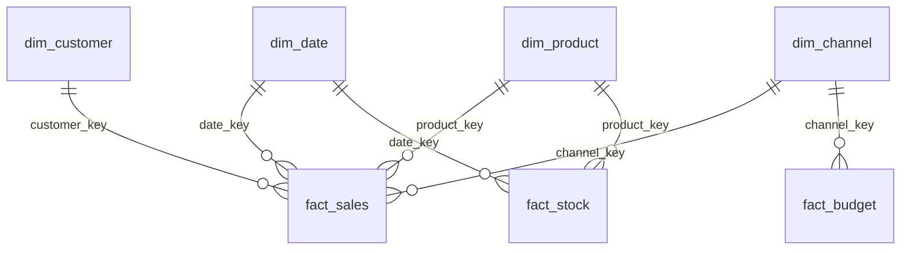

# Star Schema Design — Lab 1 Warehouse

## ERD

---

## Définitions de grain

| Table          | Grain                                      | Clé naturelle       |
|----------------|--------------------------------------------|---------------------|
| fact_sales     | 1 ligne par ligne de commande              | order_item_id       |
| fact_stock     | 1 ligne par mouvement de stock             | movement_id         |
| fact_budget    | 1 ligne par année × mois × catégorie × canal | budget_id         |

Le grain de `fact_sales` est intentionnellement fin (ligne de commande) pour permettre des analyses par produit. Les agrégations par commande se font avec `SUM(...) GROUP BY order_id`.

---

## Dimensions

### dim_date

- **Portée :** 2024-01-01 → 2026-12-31 (1096 jours, inclut l'année bissextile 2024)
- **date_key :** entier calculé `YYYYMMDD` — jointure rapide sans conversion de type
- **day_of_week :** convention DuckDB — 0 = Dimanche, 6 = Samedi
- **is_weekend :** `day_of_week IN (0, 6)`
- **season :** convention hémisphère nord (Décembre–Février = Winter)

### dim_customer

- **customer_key :** clé de substitution (`ROW_NUMBER() OVER (ORDER BY customer_id)`)
- **customer_id_src :** ID source pour les jointures de chargement
- **email :** `COALESCE(email, 'unknown@unknown.com')` — jamais NULL
- Source : `staging.customers` après déduplication et normalisation

### dim_product

- **product_key :** clé de substitution par `product_id` source
- Enrichi avec `category_name` et `department` depuis `staging.categories`
- `cost_price` utilisé dans `fact_sales` pour le calcul de marge

### dim_channel

- 3 valeurs attendues : Online (Digital), Store (Physical), Partner (Indirect)
- Dérivé des valeurs distinctes de `staging.orders.channel`
- `channel_name` porte une contrainte `UNIQUE` (les faits joignent sur ce libellé)

---

## Stratégie de clés de substitution

Toutes les dimensions utilisent `ROW_NUMBER() OVER (ORDER BY <id_source>)` comme clé de substitution lors du chargement initial. Ce pattern :
- Garantit des entiers séquentiels
- Reste déterministe (même ordre = mêmes clés sur re-chargement complet)
- Correspond à un **SCD Type 1** (remplacement complet, pas d'historique)

**SCD Type 2 non implémenté dans ce lab.** Pour une implémentation production, il faudrait ajouter des colonnes `valid_from`, `valid_to`, `is_current` et un SEQUENCE dédié pour les clés.

---

## Mesures dans fact_sales

| Mesure          | Type        | Formule                                         |
|-----------------|-------------|-------------------------------------------------|
| gross_amount    | Additif     | quantity × sale_unit_price                      |
| discount_amount | Additif     | direct depuis staging.order_items               |
| net_amount      | Additif     | gross_amount − discount_amount                  |
| cost_amount     | Additif     | quantity × cost_unit_price (dim_product)        |
| margin_amount   | Additif     | net_amount − cost_amount                        |

Toutes les mesures sont additives sur toutes les dimensions — elles peuvent être agrégées avec SUM() sans restriction.

---

## Décisions de conception

1. **fact_budget séparé de fact_sales** — grains incompatibles (budget au niveau catégorie+mois, ventes au niveau ligne). Une fact table consolidée nécessiterait des agrégations préalables. Le budget transite par `staging.budget` comme toutes les autres sources, puis est chargé dans `warehouse.fact_budget` (clé canal de substitution `channel_key`).

2. **Pas de dim_supplier ni dim_warehouse** — hors périmètre de ce lab. `fact_stock.warehouse` est stocké comme attribut dégénéré.

3. **order_status dans fact_sales** — attribut dégénéré (sans dimension correspondante) pour simplifier le filtrage par statut sans jointure supplémentaire.

