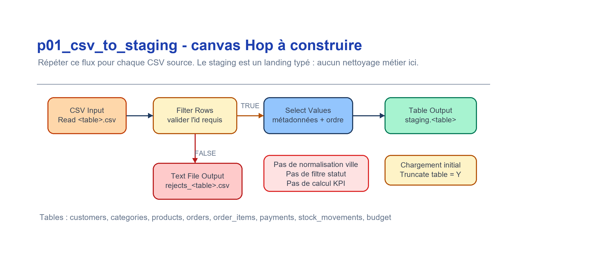

# Guide Apache Hop - Pipeline d'ingestion Lab 1

> Nouveau sur Apache Hop ? Lire d'abord `../docs/apache_hop_concepts.md`
> (projet, pipeline vs workflow, transform, Run, connexion DuckDB).

## Objectif

Construire un pipeline visuel qui charge les CSV de `data/raw/` dans `staging.*` dans DuckDB.

## Pipeline recommande

Pour chaque fichier CSV :

```text
CSV file input
  -> Select Values / Metadata
  -> controles techniques simples
  -> Table Output DuckDB staging.<table>
```

La couche staging est une copie typee minimale des sources. Ne pas y appliquer de normalisation metier, de deduplication analytique, de filtrage d'orphelins ou de calculs de mesures.



## Premier flux pas a pas (customers)

Le squelette `pipelines/p01_csv_to_staging.hpl` contient deja ce flux pour
`customers`. Ouvrez-le dans Hop GUI : c'est le modele a reproduire pour les autres
tables. Reglages reels (tels que definis dans le `.hpl`) :

1. **CSV Input - "Read customers.csv"**
   - Filename : `${DATA_DIR}/customers.csv` (le parametre `DATA_DIR` vaut `data/raw`).
   - Separator `,`, Enclosure `"`, Header `Y`.
   - Champs types : `customer_id` Integer, `customer_name` String, `email` String,
     `city` String (Trim = both), `country` String,
     `signup_date` Date (format `yyyy-MM-dd`), `segment` String.

2. **Filter Rows - "Validate customer_id"**
   - Condition : `customer_id IS NOT NULL`.
   - Send true to : "Select customer fields" (les lignes exploitables continuent).
   - Send false to : "Rejects customers" (les lignes sans id partent en rejet).

3. **Select Values - "Select customer fields"**
   - Dans le squelette, ce transform est un `Dummy` a **remplacer** par un vrai
     `Select Values` en GUI : il fige l'ordre, les noms et les types des colonnes
     finales. Ne pas normaliser `city` ici (c'est une regle warehouse, pas staging).

4. **Table Output - "Write staging.customers"**
   - Connection : `DuckDB_Lab1`.
   - Schema : `staging`, Table : `customers`.
   - Truncate table : `Y` (la table est videe avant un chargement complet).

5. **Text File Output - "Rejects customers"**
   - Fichier : `data/processed/rejects_customers.csv` (journal des lignes rejetees).

Apres execution (Run), verifiez les compteurs de lignes : la somme
`staging.customers` + rejets doit egaler le nombre de lignes du CSV.

> Reproduisez ce meme flux (CSV Input -> Filter Rows -> Select Values -> Table
> Output, + rejets) pour chacune des autres tables ci-dessous.

## Connexion DuckDB

### Option A - Connexion JDBC DuckDB

1. Ajouter le driver DuckDB JDBC a Hop.
2. Creer une connexion vers `duckdb/lab1.duckdb`.
3. Utiliser `Table Output` pour charger les tables `staging.*`.

### Option B - Secours CLI

Si la connexion DuckDB n'est pas disponible dans Hop, charger les memes tables avec DuckDB CLI :

```bash
duckdb duckdb/lab1.duckdb ".read sql/10_create_staging_schema.sql"
duckdb duckdb/lab1.duckdb ".read sql/01_load_staging_tables.sql"
```

## Noms de tables attendus

```text
staging.customers
staging.categories
staging.products
staging.orders
staging.order_items
staging.payments
staging.stock_movements
staging.budget          # sales_budget.csv : charge en Partie A, utilise en Partie B
```

## Controles Hop minimum

- presence des colonnes attendues ;
- conversions de dates et nombres ;
- valeurs vides sur identifiants techniques ;
- rejet ou marquage des lignes illisibles ;
- journalisation du nombre de lignes lues et chargees.

## Workflows d'orchestration

Les pipelines sont enchaines par des workflows `.hwf` dans `workflows/` :

- `wf_initial_load.hwf` — chargement complet : `p01` -> `dim_date` (action SQL) -> `p02_dim_customer`
  -> `p02_dim_product` -> `p02_dim_channel` -> `p03` -> `p05`, puis les controles.
- `wf_incremental_load.hwf` — chargement incremental : `p04` -> `p03`, puis les controles.
- `wf_checks.hwf` — sous-workflow de **controles** partage, appele par les deux precedents : il
  verifie les comptes attendus (`fact_stock=22`, `fact_budget=12`, aucune cle de substitution NULL
  dans `fact_sales`) et declenche une action `Abort` en cas d'ecart.
