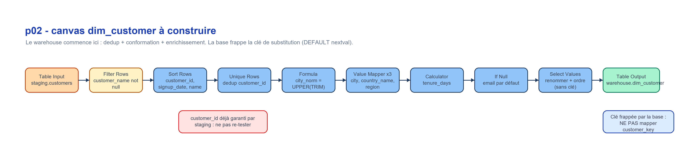
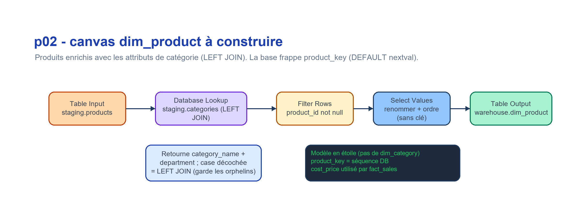
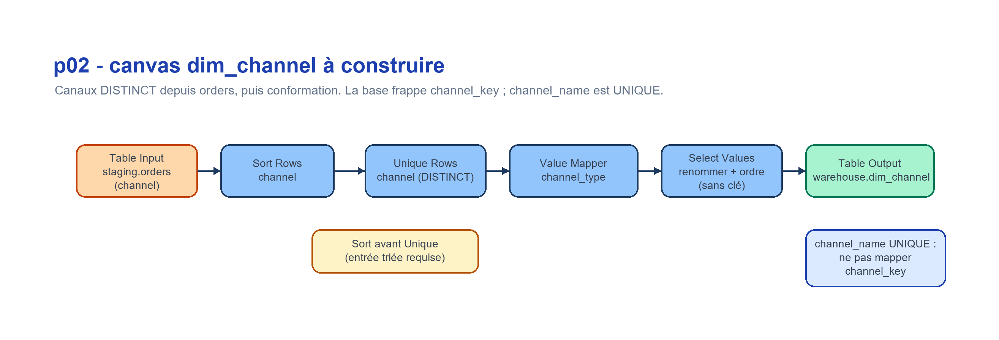
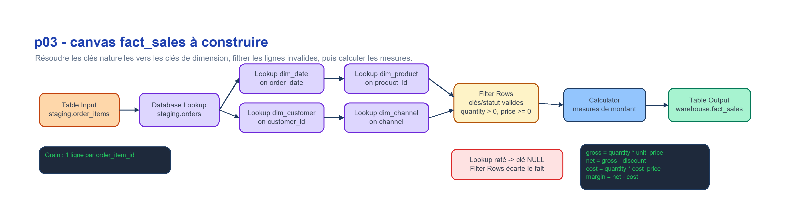
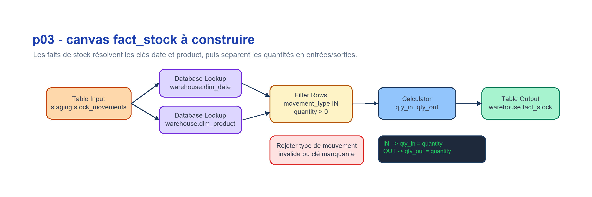

# Blueprint - p02_dim_* (dimensions) & p03_build_facts — notes approfondies

> **La recette de construction** (flux des transforms + réglages clés du dialogue GUI) est
> dans `../../lab01_consignes.md`, **Partie B-1**. Ce blueprint ne garde que les notes
> approfondies, « la leçon » et les pièges.
> Concepts Hop (transform, hop, Run, transform natif vs SQL) : `../../docs/apache_hop_concepts.md`.

## Objectif

Construire les dimensions et les tables de faits avec des transforms Hop natifs. Les scripts SQL equivalents restent un oracle de validation, mais ils ne sont pas le workflow principal.

`ExecSql` est limite au plumbing : `TRUNCATE`, creation de tables techniques, mise a jour de `control.*`. Les jointures, filtres, deduplications, lookups, cles de substitution et calculs de mesures doivent etre visibles dans le canvas Hop.

> **Les `Filter Rows` de p02/p03 ne refont pas le controle d'`id` de staging.** Staging (p01) a deja
> rejete le cas *technique* (ligne sans identifiant propre). Ici on traite le *metier/referentiel* :
> references orphelines (cle de substitution NULL apres `Database Lookup`), doublons (`Unique Rows`),
> statut invalide, `quantity > 0`, `unit_price >= 0`. Ne pas re-tester le null d'`id` deja garanti par
> staging : une condition = une seule couche. Bonne pratique : router les rejets avec un `reason_code`
> (`ORPHAN_CUSTOMER`, `INVALID_STATUS`, `DUP_CUSTOMER_ID`...) plutot que de les supprimer en silence.

## p02 - Dimensions







### dim_date

`dim_date` est un **calendrier genere** : il n'a pas de source CSV, pas de jointure, pas de
deduplication, pas de cle de substitution, pas de regle metier. C'est le seul cas du lab ou
le construire en Hop natif revient surtout a *se battre avec l'outil*. On l'aborde donc en
deux temps : **on explore** la construction native (pour comprendre ce que les transforms Hop
savent et ne savent pas faire), puis **on adopte** un `ExecSql` comme chemin retenu. Toutes
les *autres* dimensions et tous les faits restent Hop natifs.

> **Ordre :** `dim_date` doit exister **avant** les faits (p03) : les `Database Lookup` de
> `fact_sales`/`fact_stock` resolvent `date_key` depuis `order_date`/`movement_date`.

#### Explorer — construction Hop native (`p02_dim_date.hpl`)

Pipeline autonome (un `.hpl` par dimension, plus facile a deboguer). 1096 lignes :
2024-01-01 -> 2026-12-31.

```text
Generate Rows      : limit = 1096 ; un champ base_date (Date) = 2024-01-01
  -> Add Sequence  : champ day_offset ; start 0 ; increment 1            (-> 0..1095)
  -> Calculator    :
       date_actual = base_date + day_offset   (type "Date A + B days" ; A=base_date, B=day_offset)
       year        = Year of date A            (A=date_actual)
       quarter     = Quarter of date A         (A=date_actual)
       month_num   = Month of date A           (A=date_actual)
       day_num     = Day of month of date A    (A=date_actual)
       day_of_week = Day of week of date A     (A=date_actual ; voir note convention)
       date_key    = year*10000 + month_num*100 + day_num   (arithmetique entiere)
  -> Value Mapper  : month_num (1..12) -> month_name ; day_of_week -> day_name
  -> Formula       : season (depuis month_num) ; is_weekend (booleen depuis day_of_week)
  -> Select Values : ordre final = schema warehouse.dim_date
                     (date_key, date_actual, year, quarter, month_num, month_name,
                      day_num, day_name, day_of_week, is_weekend, season)
  -> Table Output  : connexion DuckDB_Lab1 ; schema warehouse ; table dim_date ; truncate = Y
```

**La lecon de l'exploration — la ou le natif s'arrete :**

- `Calculator` **sait** : `Date A + B days`, et extraire Year / Quarter / Month (numero) /
  Day of month / Day of week d'une date. Il **ne sait pas** construire une date depuis ses
  composants (annee/mois/jour) — d'ou `base_date + day_offset`.
- `Calculator` **ne fournit aucune** fonction renvoyant un **nom** de mois/jour -> `Value Mapper`.
- `Calculator` **n'a aucune** fonction conditionnelle/CASE -> `season` et `is_weekend` passent
  par `Formula` (ou `Switch / Case`).

> **Convention day-of-week — a confirmer dans Hop, ne pas supposer.** DuckDB `DAYOFWEEK`
> (utilise par `sql/21_dim_date.sql` et `docs/star_schema_design.md`) = `0=Dimanche..6=Samedi`.
> Le `Calculator` de Hop suit probablement la convention Java `1=Dimanche..7=Samedi`. Verifiez
> la numerotation reelle dans Hop ; si elle differe, **alignez-la** (decalage, ou mapping via
> `Value Mapper`) pour que `day_of_week`/`is_weekend` soient coherents avec le reste du warehouse.

#### Adopter — l'exception SQL (chemin retenu)

`dim_date` est la **seule** exception `ExecSql` sanctionnee du lab. Justification : un
calendrier est de la pure generation (aucune donnee source, aucune logique metier), donc
forcer le natif n'apporte rien pedagogiquement — les transforms qui comptent vivent dans les
*autres* dimensions et les faits, qui restent Hop natifs. Le chemin adopte execute
`sql/21_dim_date.sql`, qui produit `month_name`/`day_name`/`season` et la bonne convention
day-of-week en une seule instruction. (C'est le carve-out explicite de la regle « `ExecSql`
plumbing only » de `docs/apache_hop_concepts.md` §6.)

> **C'est ici que vivent « les transforms qui comptent ».** Contrairement a `dim_date` (exception
> SQL), `dim_customer`, `dim_product` et `dim_channel` n'ont **aucune** exception : toute leur logique
> (dedup, normalisation, enrichissement, lookup, filtre) s'exprime en transforms Hop natifs sur le
> canvas. C'est le coeur pedagogique du lab.

> **Un `.hpl` par dimension.** Chaque dimension a son propre pipeline — `p02_dim_customer.hpl`,
> `p02_dim_product.hpl`, `p02_dim_channel.hpl` — facile a deboguer (compteurs de lignes transform par
> transform). Ce sont **ces pipelines** que `wf_initial_load.hwf` orchestre directement, l'un apres
> l'autre, apres l'action SQL `dim_date` (`sql/21_dim_date.sql`).

> **La cle de substitution n'est PLUS un `Add Sequence`.** Elle est frappee par la **base** : la
> colonne `*_key` a un `DEFAULT nextval('warehouse.seq_*')` (voir `sql/20_create_warehouse_schema.sql`).
> Concretement, le `Table Output` **ne mappe pas** la colonne cle — DuckDB la remplit. Le *minting* de
> cle est du **plumbing** (couvert par la regle §6 « ExecSql = plumbing »), pas une exception SQL ; la
> logique metier, elle, reste sur le canvas. Veillez a ce que le flux arrive **trie par l'id source**
> au `Table Output` pour que les cles suivent l'ordre de l'id.

### dim_customer

```text
Table Input staging.customers
  -> Filter Rows : customer_name NOT NULL    (PAS customer_id : deja garanti par staging p01)
  -> Sort Rows   : customer_id ASC, signup_date ASC, customer_name ASC
  -> Unique Rows : comparaison = customer_id (garde la 1re ligne du tri)
  -> Formula     : city_norm = UPPER(TRIM(city))         (Calculator sait Upper, PAS Trim)
  -> Value Mapper: city_norm -> city  (CASABLANCA->Casablanca, FES/FEZ->Fes, TANGIER/TANGER->Tangier,
                   ... ; Default upon non-matching = 'Unknown')
  -> Value Mapper: country -> country_name (MA->Morocco ; Default = 'Unknown')
  -> Value Mapper: city -> region (Casablanca->Grand Casablanca, Rabat->Rabat-Sale,
                   Marrakech->Marrakech-Safi, Fes->Fes-Meknes, Tangier->Tanger-Tetouan,
                   Agadir->Souss-Massa ; Default = 'Unknown')
  -> Calculator  : tenure_days = ref_date - signup_date  (type « Date A - Date B (en jours) »)
  -> If Null     : email -> 'unknown@unknown.com'        (equivaut au COALESCE de l'oracle)
  -> Select Values: renomme customer_id -> customer_id_src ; ordre = schema dim_customer SANS la cle
                   (customer_id_src, customer_name, email, city, region, country, country_name,
                    signup_date, tenure_days, segment)
  -> Table Output: warehouse.dim_customer ; truncate = Y ; NE PAS mapper customer_key (DEFAULT nextval)
```

**La lecon — la ou le natif s'arrete (et la regle « une condition, une couche ») :**

- **`customer_id NOT NULL` n'est PAS re-teste ici.** Staging (`p01`, `Validate customer_id`) le garantit
  deja ; le re-tester violerait la regle « une condition = une seule couche » (voir `p01_blueprint.md`
  et l'encadre de `lab01_consignes.md`). Le `Filter Rows` ne porte donc que sur `customer_name`,
  que staging ne garantit pas.
- **Dedup = `Sort Rows` AVANT `Unique Rows`** : `Unique Rows` exige une entree **triee**. La regle
  « garder la plus ancienne inscription, puis le nom » se traduit par l'**ordre du Sort**
  (`customer_id, signup_date, customer_name`). *A confirmer dans Hop* que `Unique Rows` conserve bien
  la 1re ligne du groupe (sinon utiliser `Unique Rows By HashSet` / autre strategie).
- **`Value Mapper` = correspondance exacte**, sans Upper/Trim automatique -> normaliser **avant** via
  `Formula` (`UPPER(TRIM())`, car `Calculator` a `UpperCase` mais pas de Trim) ; plusieurs sources ->
  meme cible (FES/FEZ) ; non-match -> `Default upon non-matching` = 'Unknown'.
- **email jamais NULL** via le transform `If Null` (et non un COALESCE SQL cache).

**Colonnes d'enrichissement (ajoutees a dim_customer) :**

- `country_name` (`MA` -> `Morocco`) — `Value Mapper`, garde le code brut `country` a cote.
- `region` (ville normalisee -> region) — `Value Mapper`, roll-up geographique (libelle illustratif).
- `tenure_days` — `Calculator` (difference de dates en jours). **Determinisme :** utiliser une **date
  de reference fixe** (ex. `2026-12-31`, borne haute de `dim_date`), **pas** `CURRENT_DATE`, sinon
  l'oracle SQL n'est plus reproductible. L'oracle `sql/22_dim_customer.sql` utilise la meme constante.

### dim_product

```text
Table Input staging.products
  -> Database Lookup staging.categories on category_id -> retourne category_name, department
       (case « Do not pass the row if the lookup fails » DECOCHEE = LEFT JOIN)
  -> Filter Rows : product_id NOT NULL
  -> Select Values: renomme product_id -> product_id_src ; ordre = schema dim_product SANS la cle
                   (product_id_src, product_name, category_id, category_name, department,
                    unit_price, cost_price, active_flag)
  -> Table Output: warehouse.dim_product ; truncate = Y ; NE PAS mapper product_key (DEFAULT nextval)
```

**La lecon :**

- **`category_name` + `department` sont denormalises DANS `dim_product`** : modele en **etoile**, pas
  en flocon — il n'y a **pas** de `dim_category`. Le `Database Lookup` ne sert pas a valider, il
  **rapatrie des attributs**.
- **Le piege du `Database Lookup` = la case « Do not pass the row if the lookup fails »** : cochee, elle
  transforme la jointure en INNER et fait disparaitre silencieusement les produits sans categorie ;
  l'oracle fait un `LEFT JOIN` -> **garder decochee** (la ligne passe, `category_name`/`department`
  NULL). Sur ces donnees tous les `category_id` existent, donc l'orphelin est un **principe**, pas un
  cas reel ici.
- `cost_price` est conserve (utilise par `fact_sales` pour la marge). `Stream Lookup` est une
  alternative valable (`categories` est petite).

### dim_channel

```text
Table Input staging.orders (selectionner channel)
  -> Sort Rows   : channel ASC
  -> Unique Rows : comparaison = channel  (= SELECT DISTINCT channel)
  -> Value Mapper: channel -> channel_type (Online->Digital, Store->Physical, Partner->Indirect ;
                   Default upon non-matching = 'Unknown')
  -> Select Values: renomme channel -> channel_name ; ordre = schema dim_channel SANS la cle
                   (channel_name, channel_type)
  -> Table Output: warehouse.dim_channel ; truncate = Y ; NE PAS mapper channel_key (DEFAULT nextval)
```

**La lecon :** `channel_name` porte une contrainte `UNIQUE` (les faits joignent sur ce libelle) -> la
dedup `Sort Rows + Unique Rows` n'est pas cosmetique, elle est **obligatoire**. Meme contrainte
d'entree triee que `dim_customer`.

## p03 - Faits





### fact_sales

```text
Table Input staging.order_items
  -> Database Lookup staging.orders on order_id
  -> Database Lookup warehouse.dim_date on order_date
  -> Database Lookup warehouse.dim_customer on customer_id
  -> Database Lookup warehouse.dim_product on product_id
  -> Database Lookup warehouse.dim_channel on channel
  -> Filter Rows (valid keys, valid status, quantity > 0, unit_price >= 0)
  -> Calculator (gross_amount, net_amount, cost_amount, margin_amount)
  -> Table Output warehouse.fact_sales
```

Grain : 1 ligne par `order_item_id`.  
Cle : `sales_key` est une cle de substitution **frappee par la base** (`DEFAULT nextval('warehouse.seq_fact_sales')`) ; le `Table Output` n'inclut **pas** `sales_key`. `order_item_id` est conserve comme `order_item_id_src` pour la tracabilite. Idem pour `fact_stock` : `stock_key` via sequence, `movement_id` conserve comme `movement_id_src`.

### fact_stock

```text
Table Input staging.stock_movements
  -> Database Lookup warehouse.dim_date on movement_date
  -> Database Lookup warehouse.dim_product on product_id
  -> Filter Rows (movement_type IN, quantity > 0)
  -> Calculator (qty_in, qty_out)
  -> Table Output warehouse.fact_stock
```

## Verifications

```sql
SELECT COUNT(*) FROM warehouse.dim_date;
-- Attendu : 1096

SELECT COUNT(*) FROM warehouse.fact_sales
WHERE date_key IS NULL OR customer_key IS NULL OR product_key IS NULL;
-- Attendu : 0

SELECT order_status, COUNT(*), ROUND(SUM(net_amount),2)
FROM warehouse.fact_sales
GROUP BY order_status
ORDER BY 3 DESC;
```

> Réglages détaillés du dialogue GUI (Database Lookup, clé de substitution, Sort/Unique Rows,
> Value Mapper, If Null, Formula, Calculator, Filter Rows) : tableau « Réglages clés par
> transform » de la **Partie B-1** des consignes.
>
> Rappel : les `Database Lookup` de p03 résolvent les clés de substitution ; si une clé
> ressort NULL, la ligne n'a pas matché une dimension (vérifier l'ordre p02 avant p03).

## Pieges courants

- Lancer p03 avant p02 : les `Database Lookup` sur les dimensions ne trouvent rien -> cles NULL.
- Oublier de truncater une dimension/un fait avant rechargement -> doublons.
- Mapper la colonne `*_key` dans le `Table Output` : elle entre alors en conflit avec le `DEFAULT
  nextval` du schema. La cle est frappee par la base — ne pas l'inclure dans le mapping. (Frapper la
  cle cote DB est le **bon** chemin : c'est du plumbing. Le vrai piege est de cacher une
  **jointure / un filtre / une dedup** dans du SQL au lieu de transforms natifs.)
- Confondre le `Add Sequence` du `day_offset` de `dim_date` (un compteur de lignes, legitime) avec une
  cle de substitution (qui, elle, vient de la base).

## Notes Hop GUI

1. Truncatez les tables cibles avant de recharger une dimension ou un fait.
2. Preferez `Database Lookup` ou `Stream Lookup` aux jointures SQL.
3. Utilisez `Calculator` pour les mesures, pas une expression SQL cachee.
4. Verifiez les compteurs de lignes entre chaque transform pendant la construction.
