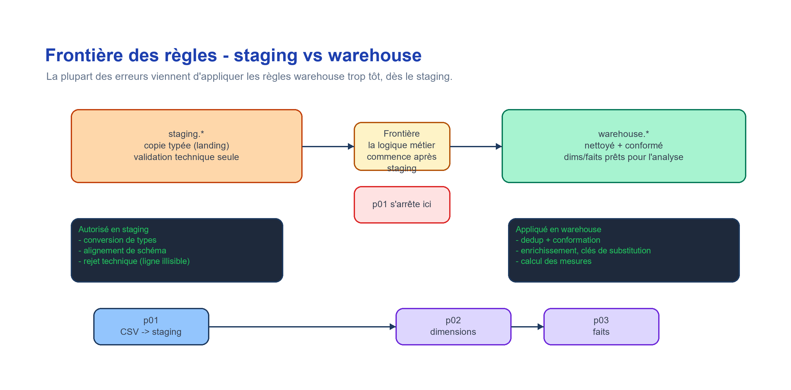
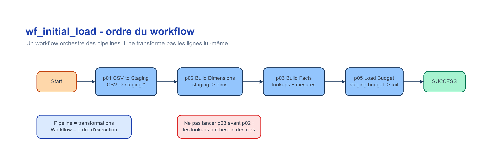
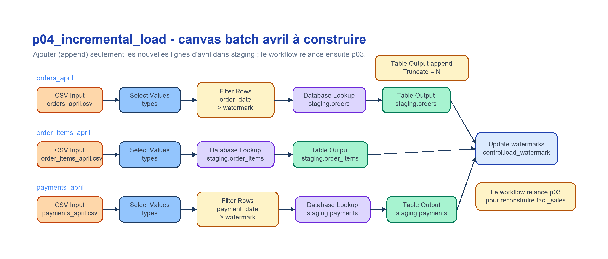
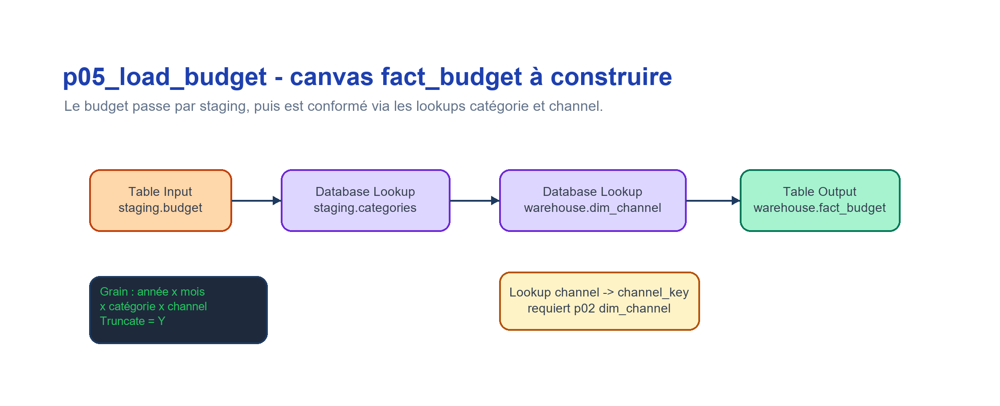

# Lab 1 — Apache Hop + DuckDB : consignes

> **Setup fait une fois ?** Installation (Java, Apache Hop, DuckDB CLI, driver JDBC),
> création du projet Hop, vérification de la connexion DuckDB et création des schémas :
> tout est dans **`guide_setup.md`**. Faites-le **avant** de commencer ce document, puis
> revenez ici : ces consignes sont le document de travail du lab de bout en bout.

Ce lab se fait **d'une traite** : la **Partie A** charge les CSV sources vers `staging.*` et
explore leur qualité ; la **Partie B** prolonge directement ce staging en schéma en étoile
`warehouse.*`, chargement incrémental et budget vs réalisé. Il se déroule **en séance** : il
n'y a **aucun rendu à remettre**.

## Scénario métier

Vous travaillez pour une entreprise retail/e-commerce qui vend des produits électroniques et mobilier de bureau. Les données viennent de plusieurs systèmes opérationnels : commandes, clients, produits, paiements et mouvements de stock.

La direction souhaite un premier diagnostic :

- les données sont-elles exploitables pour la BI ?
- quels problèmes de qualité doivent être corrigés ?
- quels KPI peut-on produire de manière fiable ?
- quelles questions métier restent ambiguës ?


---

# Partie A — Ingestion + exploration

## Étape 1 — Ingestion avec Apache Hop

> **Nouveau sur Apache Hop ?** Lire `docs/apache_hop_concepts.md` (projet, pipeline
> vs workflow, transform, exécution Run, connexion DuckDB) avant de commencer.

On construit un **pipeline visuel** plutôt que d'écrire du SQL à la main : chaque
étape (lecture CSV, contrôle, écriture) est explicite et rejouable. La couche
`staging.*` est une **copie typée** des sources (conversion de types, alignement des
colonnes), sans nettoyage métier — celui-ci viendra en Partie B.

> **Deux chemins disponibles**
> - **Chemin officiel (Hop GUI) :** créer et exécuter le pipeline Apache Hop comme décrit ci-dessous.
> - **Alternative CLI (si Hop indisponible) :** exécuter directement `duckdb duckdb/lab1.duckdb ".read sql/01_load_staging_tables.sql"` depuis la racine du lab. Les étapes 2 à 4 sont identiques dans les deux cas.

Créer un pipeline Apache Hop qui :

1. lit les fichiers CSV ;
2. applique un contrôle simple de types ou de colonnes ;
3. charge les données dans une base DuckDB locale ;
4. conserve les noms de tables suivants :

```text
staging.customers
staging.categories
staging.products
staging.orders
staging.order_items
staging.payments
staging.stock_movements
staging.budget
```

Les fichiers `orders_april.csv`, `order_items_april.csv` et `payments_april.csv` sont réservés à la Partie B (batch incrémental d'avril) : ils ne doivent **pas** être chargés dans les tables `staging.*` de la Partie A. En revanche, `sales_budget.csv` est chargé dès la Partie A dans `staging.budget` (selon la même recette `p01`) ; il sera utilisé plus tard pour le budget vs réalisé (Partie B-4).

**Apercu du canvas Hop attendu :**


**Recette de construction (`p01_csv_to_staging`) — à reproduire pour chaque table.**

> Gestes de base dans Hop GUI (créer un pipeline, déposer un transform, tirer un hop,
> Run et lire les compteurs) : `docs/apache_hop_concepts.md` §4. Pour la « leçon »
> détaillée et les pièges, voir `hop/blueprints/p01_blueprint.md`.

Flux d'une table (exemple `customers`) :

```text
[CSV Input : Read customers.csv]
        |
        v
[Filter Rows : Validate customer_id]
        |TRUE                         FALSE
        v                               \
[Select Values : Select customer fields] \-> [Text File Output : Rejects customers]
        |
        v
[Table Output : Write staging.customers]
```

Réglages clés par transform (dialogue GUI) :

| Transform | Réglages à vérifier dans le dialogue |
|-----------|--------------------------------------|
| CSV Input | Filename `${DATA_DIR}/customers.csv` ; Separator `,` ; Enclosure `"` ; Header `Y` ; champs typés (ex. `customer_id` Integer, `signup_date` Date format `yyyy-MM-dd`, `city` String Trim `both`) |
| Filter Rows | Condition `customer_id IS NOT NULL` ; Send true to `Select customer fields` ; Send false to `Rejects customers` |
| Select Values | Fige noms / types / ordre des colonnes finales ; **ne pas** normaliser `city` ici (règle warehouse, pas staging) |
| Table Output | Connection `DuckDB_Lab1` ; Schema `staging` ; Table `customers` ; **Truncate table `Y`** (chargement complet) |
| Text File Output | Fichier `data/processed/rejects_customers.csv` (journal des rejets, `reason_code = MISSING_KEY`) |

> Après le Run, le contrôle se réconcilie : `lignes chargées + rejets = lignes du CSV`.
> Le `Validate <id>` ne rejette qu'un cas **technique** (ligne sans identifiant propre) ;
> les rejets métier/référentiels (orphelins, doublons, statut) sont traités plus tard, au
> chargement warehouse (Partie B-1) — **une condition, une seule couche**.

Reproduire ce même flux (CSV Input → Filter Rows → Select Values → Table Output, + branche
rejets) pour chacune des tables `staging.*` listées ci-dessus.

**Règles autorisées en staging :**

- conversion de types ;
- alignement des colonnes ;
- rejet technique des lignes illisibles ou sans identifiant obligatoire ;
- déduplication uniquement si elle est nécessaire pour éviter un échec de chargement.

**Règles à ne pas appliquer en staging :**

- normalisation des villes ;
- filtrage métier des statuts de commande ;
- suppression des références orphelines ;
- enrichissement produit avec les catégories ;
- calcul de mesures.

> **Le contrôle d'`id` en staging et celui au chargement des dimensions ne sont PAS le même contrôle.**
> C'est une confusion fréquente : on dirait qu'on filtre deux fois la même chose. En réalité :
>
> | Problème | Nature | Couche | Pourquoi |
> |----------|--------|--------|----------|
> | La ligne n'a **pas d'identifiant propre** (ex. `order_item_id` vide) | **Technique** — la ligne ne peut être ni clé-ée, ni dédupliquée, ni suivie | **Staging** | Sans clé propre, la ligne est inexploitable *en tant qu'enregistrement*, indépendamment de toute règle métier |
> | La ligne référence un id **inexistant** (référence orpheline), `customer_id` en double, statut invalide | **Métier / référentiel** | **Warehouse** (dim/faits) | C'est de la conformation : déduplication, mapping vers clé de substitution, exclusion des orphelins |
>
> **Deux règles à retenir :**
> 1. On ne rejette en staging que ce qui rend une ligne *techniquement* impossible à traiter (illisible, sans identifiant obligatoire). Tout ce qui demande un jugement métier est reporté au chargement warehouse.
> 2. Une même condition n'est vérifiée que dans **une seule** couche. Si staging garantit « toute ligne a un identifiant propre non nul », le chargement des dimensions ne re-teste pas cette condition : il fait confiance à staging et ne traite que le référentiel/métier.
>
> **Bonne pratique (au lieu de supprimer) :** router les lignes rejetées vers une table de quarantaine (`control.rejects`) avec un `reason_code` (`MISSING_KEY` en staging ; `ORPHAN_CUSTOMER`, `INVALID_STATUS`, `DUP_CUSTOMER_ID`… au warehouse). Ainsi rien ne disparaît silencieusement et le compte se réconcilie : `chargées + rejetées = source`.

## Étape 2 — Exploration dans DuckDB

Avant de lancer les scripts, parcourez les fichiers `data/raw/` et identifiez les entités métier et leurs relations.

Ouvrir la base DuckDB en mode interactif (depuis le dossier `labs/lab01_hop_duckdb`), puis exécuter les scripts avec `.read` :

```bash
duckdb duckdb/lab1.duckdb
.read sql/02_profile_tables.sql
.read sql/03_quality_checks.sql
```

> Pour quitter la CLI DuckDB : `.quit`

**Résultats obligatoires :**

- nombre de lignes par table ;
- doublons sur les clés supposées ;
- valeurs nulles critiques ;
- ruptures de relations entre tables ;
- quelles anomalies restent visibles dans `staging.*` et devront être traitées au chargement warehouse (Partie B).

**Aller plus loin (optionnel si le temps le permet) :**

- incohérences de montants ou quantités ;
- premier calcul de chiffre d'affaires (`sql/04_kpi_exploration.sql`) ;
- ventes par mois, canal et catégorie.

> Ces analyses sont reprises en profondeur dans la Partie B sur le schéma en étoile.

## Étape 3 — Rapport qualité initial

Identifier **au moins 3 anomalies** de qualité dans les données.

Pour chaque anomalie :

| Anomalie | Impact métier | Gravité | Correction proposée |
|----------|--------------|---------|---------------------|

## Étape 4 — Premiers KPI

Définir **3 KPI candidats**.

Pour chaque KPI :

- nom ;
- définition ;
- grain ;
- source ;
- décision que le KPI aide à prendre.

---

# Partie B — ETL classique, modélisation & chargement

Cette partie prolonge la Partie A. Elle suppose que les sources principales ont été comprises, que la base DuckDB locale est utilisable, et que les tables `staging.*` peuvent être recréées avec `sql/01_load_staging_tables.sql`.

> **Connexion Hop.** La connexion `DuckDB_Lab1` est déjà définie dans
> `hop/metadata/rdbms/DuckDB_Lab1.json` et pointe vers `${PROJECT_HOME}/duckdb/lab1.duckdb`.
> Si le **Test connection** échoue, revoir `guide_setup.md` (driver JDBC, Project Home,
> metadata base folder).

## Architecture des couches

```text
data/raw/      (CSV sources)
      -> Hop native ETL
staging.*      (tables typées, landing : copie minimale des CSV)
      -> Hop native ETL
warehouse.*    (dimensions, faits, budget : données nettoyées et conformées)
control.*      (watermarks de chargement, log)
```

`staging.*` n'est pas une couche métier nettoyée. Elle sert de zone d'atterrissage typée : conversion de types, alignement de schéma, rejets techniques si une ligne est illisible. La déduplication, la normalisation, les jointures, les filtres métier, le mapping des clés de substitution et les calculs de mesures se font pendant les chargements `warehouse.*`.

Les scripts SQL restent disponibles comme oracle de validation et chemin de secours CLI. Le workflow principal à construire dans Hop doit utiliser des transforms Hop natifs, pas des transformations SQL `INSERT ... SELECT`.



**Ordre du workflow initial :**



> **Pré-requis warehouse (une seule fois).** Avant de construire les dimensions et les faits,
> créer le schéma, les **séquences** et les tables du warehouse, puis le schéma de contrôle.
> Depuis le dossier du lab :
>
> ```powershell
> cd labs/lab01_hop_duckdb
> duckdb duckdb/lab1.duckdb ".read sql/20_create_warehouse_schema.sql"
> duckdb duckdb/lab1.duckdb ".read sql/40_create_control_schema.sql"
> ```
>
> `20_create_warehouse_schema.sql` crée des **séquences** `warehouse.seq_*` ; chaque colonne
> clé (`customer_key`, `product_key`, `channel_key`, `sales_key`, `stock_key`) a un
> `DEFAULT nextval(...)`. **Conséquence dans Hop :** le `Table Output` **ne mappe pas** la
> colonne clé — DuckDB la remplit. Exceptions : `dim_date.date_key` (YYYYMMDD calculé) et
> `fact_budget.budget_id` (clé naturelle).

## Objectifs

> **La couche `staging.*` est déjà construite en Partie A — Étape 1** (pipeline `p01`, les
> 8 tables dont `staging.budget`). La Partie B ne recharge pas le staging : elle le **prolonge**
> directement en schéma en étoile, puis en chargements warehouse. Au chargement complet (Partie B-2),
> le workflow `wf_initial_load` **ré-exécute `p01`** automatiquement — c'est de l'orchestration,
> pas une reconstruction manuelle.

### Partie B-1 — Modèle en étoile (30 min)

Construire le data warehouse dimensionnel depuis `staging.*` vers `warehouse.*` avec des transforms Hop natifs.

Règles appliquées pendant les chargements warehouse :

- Clients : déduplication sur `customer_id`, normalisation des noms de villes, valeur email par défaut si manquante, + colonnes enrichies `country_name`, `region`, `tenure_days`
- Produits : enrichissement avec `category_name` et `department` depuis `staging.categories`
- Commandes : exclusion des références clients orphelines et des statuts invalides lors du chargement des faits
- Lignes de commandes : exclusion des références orphelines, `quantity > 0`, `unit_price >= 0`
- Mouvements de stock : `movement_type IN ('IN','OUT')`, références produits valides
- Faits : mapping vers les clés de substitution et calcul de `gross_amount`, `net_amount`, `cost_amount`, `margin_amount`

> `fact_sales.sales_key` est une clé de substitution **frappée par la base** (séquence DuckDB +
> `DEFAULT nextval`) : le `Table Output` n'inclut pas la colonne clé. La clé naturelle `order_item_id`
> est conservée comme `order_item_id_src`. Même principe pour toutes les clés de substitution du
> warehouse (`customer_key`, `product_key`, `channel_key`, `stock_key`).

> **`dim_date` (calendrier généré) — à construire AVANT les faits.** Les `Database Lookup` de
> `fact_sales`/`fact_stock` (p03) résolvent `date_key` depuis la date : si `dim_date` est vide,
> les clés ressortent NULL. C'est une dimension à part : **on explore** d'abord sa construction
> Hop native (pipeline autonome `p02_dim_date.hpl`, pour voir ce que `Calculator` sait et ne
> sait pas faire), **puis on adopte** un `ExecSql` (`sql/21_dim_date.sql`) comme chemin retenu —
> c'est la seule exception SQL sanctionnée du lab, car un calendrier n'a ni source, ni jointure,
> ni logique métier. Toutes les autres dimensions restent Hop natives. Détail du recipe et de la
> justification : voir la section `dim_date` de `hop/blueprints/p02_p03_blueprint.md`.
>
> Dans le workflow orchestré, `dim_date` est une **action `SQL`** qui exécute `sql/21_dim_date.sql`
> (action « Build dim_date » de `wf_initial_load.hwf`), placée avant les pipelines de dimensions et
> les faits.

> **Les trois autres dimensions restent 100 % Hop natives** — c'est ici que les transforms qui comptent
> prouvent leur valeur. Chacune a son **propre pipeline** `.hpl`
> (`hop/pipelines/p02_dim_customer.hpl`, `p02_dim_product.hpl`, `p02_dim_channel.hpl`) ; ce sont ces
> pipelines que `wf_initial_load.hwf` orchestre directement, l'un après l'autre, après l'action `SQL`
> `dim_date`. Idée clé de chacune (détail et réglages GUI : `hop/blueprints/p02_p03_blueprint.md`) :
> - **dim_customer** : déduplication `Sort Rows → Unique Rows` (sur `customer_id`), normalisation ville
>   (`Formula` `UPPER(TRIM)` → `Value Mapper`), email par défaut (`If Null`), + enrichissement
>   `country_name` / `region` / `tenure_days`. `customer_id NOT NULL` **n'est pas re-testé** (déjà
>   garanti par staging — une condition, une couche).
> - **dim_product** : catégorie dénormalisée via `Database Lookup staging.categories` en **LEFT JOIN**
>   (case « Do not pass the row if the lookup fails » **décochée**) — modèle en étoile, pas de dim_category.
> - **dim_channel** : `DISTINCT` canal (`Sort Rows → Unique Rows`) + `Value Mapper` pour `channel_type` ;
>   `channel_name` porte une contrainte `UNIQUE`.

**Les faits (p03).** `fact_sales` et `fact_stock` se construisent via `Database Lookup` sur les
dimensions (résolution des clés de substitution) + `Calculator` pour les mesures. **Les dimensions
doivent exister avant** (sinon les clés ressortent NULL).

**Oracle SQL :** `sql/20_create_warehouse_schema.sql` + `sql/21_dim_date.sql` à `sql/31_fact_stock.sql`.

Voir `docs/star_schema_design.md` pour l'ERD complet et les définitions de grain.

**Apercus des canvases Hop a construire :**


**Recettes de construction (p02 dimensions, p03 faits).**

> Gestes de base dans Hop GUI : `docs/apache_hop_concepts.md` §4. Pour « la leçon »
> détaillée (ce que `Calculator` sait/ne sait pas, conventions à confirmer) et les pièges,
> voir `hop/blueprints/p02_p03_blueprint.md`.

**`dim_customer`** (`p02_dim_customer.hpl`) :

```text
Table Input staging.customers
  -> Filter Rows : customer_name NOT NULL      (PAS customer_id : déjà garanti par staging p01)
  -> Sort Rows   : customer_id ASC, signup_date ASC, customer_name ASC
  -> Unique Rows : comparaison = customer_id   (garde la 1re ligne du tri)
  -> Formula     : city_norm = UPPER(TRIM(city))            (Calculator sait Upper, PAS Trim)
  -> Value Mapper: city_norm -> city  (CASABLANCA->Casablanca, FES/FEZ->Fes, ... ; Default = 'Unknown')
  -> Value Mapper: country -> country_name (MA->Morocco ; Default = 'Unknown')
  -> Value Mapper: city -> region (Casablanca->Grand Casablanca, ... ; Default = 'Unknown')
  -> Calculator  : tenure_days = ref_date - signup_date   (type « Date A - Date B (en jours) »)
  -> If Null     : email -> 'unknown@unknown.com'
  -> Select Values: renomme customer_id -> customer_id_src ; ordre = schéma dim_customer SANS la clé
  -> Table Output: warehouse.dim_customer ; truncate = Y ; NE PAS mapper customer_key (DEFAULT nextval)
```

> **Déterminisme `tenure_days` :** utiliser une **date de référence fixe** (ex. `2026-12-31`, borne
> haute de `dim_date`), **pas** `CURRENT_DATE`, pour rester reproductible vis-à-vis de l'oracle SQL.

**`dim_product`** (`p02_dim_product.hpl`) :

```text
Table Input staging.products
  -> Database Lookup staging.categories on category_id -> retourne category_name, department
       (case « Do not pass the row if the lookup fails » DÉCOCHÉE = LEFT JOIN)
  -> Filter Rows : product_id NOT NULL
  -> Select Values: renomme product_id -> product_id_src ; ordre = schéma dim_product SANS la clé
  -> Table Output: warehouse.dim_product ; truncate = Y ; NE PAS mapper product_key (DEFAULT nextval)
```

> Le `Database Lookup` ne **valide** pas, il **rapatrie des attributs** (`category_name`,
> `department`) : modèle en **étoile**, pas de `dim_category`. Garder `cost_price` (marge de `fact_sales`).

**`dim_channel`** (`p02_dim_channel.hpl`) :

```text
Table Input staging.orders (sélectionner channel)
  -> Sort Rows   : channel ASC
  -> Unique Rows : comparaison = channel   (= SELECT DISTINCT channel)
  -> Value Mapper: channel -> channel_type (Online->Digital, Store->Physical, Partner->Indirect ; Default = 'Unknown')
  -> Select Values: renomme channel -> channel_name ; ordre = schéma dim_channel SANS la clé
  -> Table Output: warehouse.dim_channel ; truncate = Y ; NE PAS mapper channel_key (DEFAULT nextval)
```

> `channel_name` porte une contrainte `UNIQUE` (les faits joignent dessus) → la dédup
> `Sort Rows + Unique Rows` est **obligatoire**, pas cosmétique.

**`dim_date`** — chemin retenu : **action SQL** `sql/21_dim_date.sql` (seule exception du lab,
voir l'encadré ci-dessus). L'exploration native (`p02_dim_date.hpl` : `Generate Rows → Add Sequence
→ Calculator → Value Mapper → Formula → Table Output`) sert à comprendre les limites du natif ;
détail et convention day-of-week à confirmer : `hop/blueprints/p02_p03_blueprint.md` §dim_date.

**`fact_sales`** (`p03`) :

```text
Table Input staging.order_items
  -> Database Lookup staging.orders        on order_id
  -> Database Lookup warehouse.dim_date    on order_date     -> date_key
  -> Database Lookup warehouse.dim_customer on customer_id   -> customer_key
  -> Database Lookup warehouse.dim_product  on product_id    -> product_key
  -> Database Lookup warehouse.dim_channel  on channel       -> channel_key
  -> Filter Rows : clés non NULL, statut valide, quantity > 0, unit_price >= 0
  -> Calculator  : gross_amount, net_amount, cost_amount, margin_amount
  -> Table Output: warehouse.fact_sales ; NE PAS mapper sales_key (DEFAULT nextval) ; garder order_item_id_src
```

Grain : 1 ligne par `order_item_id`.

**`fact_stock`** (`p03`) :

```text
Table Input staging.stock_movements
  -> Database Lookup warehouse.dim_date    on movement_date  -> date_key
  -> Database Lookup warehouse.dim_product on product_id     -> product_key
  -> Filter Rows : movement_type IN ('IN','OUT'), quantity > 0
  -> Calculator  : qty_in, qty_out
  -> Table Output: warehouse.fact_stock ; NE PAS mapper stock_key (DEFAULT nextval) ; garder movement_id_src
```

**Réglages clés par transform (dialogue GUI)** — les transforms le plus souvent ratés :

| Transform | Réglages à vérifier dans le dialogue |
|-----------|--------------------------------------|
| Database Lookup | Connection `DuckDB_Lab1` ; table de référence ; clé(s) de jointure ; champ(s) retourné(s) ; **case « Do not pass the row if the lookup fails »** : DÉCOCHÉE = LEFT JOIN (garde la ligne, valeurs NULL) ; cochée = INNER (rejette) |
| Clé de substitution | **PAS de `Add Sequence`** : la colonne `*_key` a un `DEFAULT nextval('warehouse.seq_*')` ; le `Table Output` **ne mappe pas** la colonne clé. Flux trié par l'id source pour des clés ordonnées |
| Sort Rows | Champs + sens (ASC/DESC) ; **prérequis de `Unique Rows`** (entrée triée) |
| Unique Rows | Champ(s) de comparaison ; exige une entrée **triée** ; garde la 1re ligne du groupe (à confirmer dans Hop) |
| Value Mapper | `Fieldname to use` (source) ; `Target field name` ; table source→cible (match **exact**, pas d'Upper/Trim auto) ; `Default upon non-matching` (ex. 'Unknown') |
| If Null | Champ(s) cible(s) + valeur de remplacement (ex. `email` → 'unknown@unknown.com') |
| Formula | Expression libformula (ex. `UPPER(TRIM([city]))`) — quand `Calculator` ne suffit pas (pas de Trim) |
| Calculator | Une ligne par calcul ; New field + Calculation + champs A/B (ex. `gross_amount` = `quantity` * `unit_price`) |
| Filter Rows | Validité métier : clés non NULL après lookups, statut valide, `quantity > 0`, `unit_price >= 0` (ne PAS re-tester un null d'id déjà garanti par staging) |

**Pièges courants :**
- Lancer p03 avant p02 → les `Database Lookup` ne trouvent rien → clés NULL.
- Oublier de truncater une dimension/un fait avant rechargement → doublons.
- Mapper la colonne `*_key` dans le `Table Output` → conflit avec le `DEFAULT nextval`.

**Questions d'analyse :**
1. Quelle est la granularité de `fact_sales` ? de `fact_stock` ?
2. Pourquoi utilise-t-on des clés de substitution (`customer_key`) plutôt que les IDs sources ?

### Partie B-2 — Chargement initial (20 min)

**Chemin Hop (principal) :** ouvrir `hop/workflows/wf_initial_load.hwf` dans Hop GUI et l'exécuter (Run). Le workflow enchaîne `p01` → `dim_date` (action SQL) → `p02_dim_customer` → `p02_dim_product` → `p02_dim_channel` → `p03` → `p05`, puis une étape de **contrôles** (voir ci-dessous). Vérifier que toutes les actions passent au vert.

> **Contrôles intégrés.** Après le chargement, le workflow vérifie lui-même les comptes attendus :
> une action `Eval fact_sales = 176`, puis le sous-workflow `wf_checks.hwf` (`fact_stock=22`,
> `fact_budget=12`, aucune clé de substitution NULL dans `fact_sales`). En cas d'écart, le workflow
> bascule sur l'action `Abort` au lieu de `SUCCESS`. **Ces contrôles restent rouges tant que les
> pipelines ne sont pas complétés (ou que l'oracle `sql/50_initial_full_load.sql` n'a pas peuplé le
> warehouse)** : un contrôle rouge signale un chargement incomplet, pas un lab cassé.


Chemin de secours CLI :

```bash
duckdb duckdb/lab1.duckdb ".read sql/50_initial_full_load.sql"
```

> **Ordre d'exécution :** lancer les scripts dans l'ordre `50` → `51` → `52`, une seule fois chacun.
> Ne pas relancer `50_initial_full_load.sql` après `51` : il réinitialise le warehouse et le watermark.

**Résultat attendu :**

```text
FULL LOAD COMPLETE | fact_sales_rows=176 | fact_stock_rows=22 | fact_budget_rows=12 | latest_order_date=2025-03-21
```

Validations :

```sql
SELECT COUNT(*) FROM warehouse.fact_sales
WHERE date_key IS NULL OR customer_key IS NULL OR product_key IS NULL;
-- Attendu : 0

SELECT COUNT(*) FROM staging.orders o
LEFT JOIN warehouse.dim_date dd ON o.order_date = dd.date_actual
WHERE dd.date_key IS NULL;
-- Attendu : 0

SELECT COUNT(*) FROM warehouse.dim_channel;   -- Attendu : 3
SELECT COUNT(*) FROM warehouse.fact_budget;   -- Attendu : 12
```

### Partie B-3 — Chargement incrémental (30 min)

Simuler l'arrivée d'un nouveau batch (commandes d'avril 2025).

Le watermark `control.load_watermark` stocke la date du dernier chargement. Le pipeline incrémental ajoute les lignes typées dans `staging.*`, puis reconstruit les faits concernés.

**Chemin Hop (principal) :** ouvrir `hop/workflows/wf_incremental_load.hwf` dans Hop GUI et l'exécuter (Run). Le workflow orchestre `p04 → p03` (rebuild des faits), puis les **contrôles** (`Eval fact_sales = 182` + sous-workflow `wf_checks.hwf`). Comme en B-2, un contrôle rouge = chargement incomplet (ou oracle `sql/51_incremental_load.sql` non exécuté), pas un lab cassé.



**Recette de construction (`p04_incremental_load`).**

> Gestes de base : `docs/apache_hop_concepts.md` §4. « La leçon » détaillée et les pièges :
> `hop/blueprints/p04_blueprint.md`. `p04` charge seulement le batch dans `staging.*` et met à
> jour les watermarks ; c'est `wf_incremental_load.hwf` qui enchaîne ensuite `p03` pour les faits.

Trois branches parallèles (une par source d'avril) + mise à jour des watermarks :

```text
[CSV Input : orders_april.csv]
  -> Select Values (types)
  -> Filter Rows (order_date > watermark orders)
  -> Database Lookup staging.orders (dédup order_id)
  -> Table Output staging.orders          (Truncate N)

[CSV Input : order_items_april.csv]
  -> Select Values (types)
  -> Database Lookup staging.order_items (dédup order_item_id)
  -> Table Output staging.order_items     (Truncate N)

[CSV Input : payments_april.csv]
  -> Select Values (types)
  -> Filter Rows (payment_date > watermark payments)
  -> Database Lookup staging.payments (dédup payment_id)
  -> Table Output staging.payments        (Truncate N)

[ExecSql : Update control.load_watermark]   (orders, payments)
```

Réglages clés par transform (dialogue GUI) :

| Transform | Réglages à vérifier dans le dialogue |
|-----------|--------------------------------------|
| CSV Input | Filename `${DATA_DIR}/orders_april.csv` (idem order_items_april / payments_april) ; **mêmes types** que le chargement initial |
| Filter Rows | Condition `order_date > watermark` (resp. `payment_date > watermark`) : ne garder que le nouveau batch |
| Database Lookup | Sur `staging.orders` / `staging.order_items` / `staging.payments` par clé naturelle : écarte les doublons déjà chargés |
| Table Output | Connection `DuckDB_Lab1` ; schema `staging` ; **Truncate `N`** (append du batch, surtout pas de remise à zéro) |
| ExecSql | Uniquement pour lire/mettre à jour `control.load_watermark` (plumbing autorisé) |

**Pièges courants :**
- **Truncate `Y`** sur le `Table Output` staging → on efface l'historique au lieu d'ajouter le batch.
- Oublier de mettre à jour `control.load_watermark` → le batch est rejoué au prochain Run.
- Croire que p04 reconstruit les faits : non, c'est `wf_incremental_load.hwf` qui enchaîne p03 ensuite.

Chemin de secours CLI :

```bash
duckdb duckdb/lab1.duckdb ".read sql/51_incremental_load.sql"
```

> **Modèle mental (résumé).** Le **watermark** ne laisse passer que les lignes `date > dernier
> chargement`. Le **staging accumule** (append, dédup idempotente) ; les **faits sont reconstruits**
> (`TRUNCATE` + rebuild depuis tout le staging). Les **dimensions ne sont pas rejouées** en
> incrémental — correct ici car le batch d'avril (clients 1-5, produits 101/102/104/106) n'amène
> aucun nouveau membre.
>
> **Détail complet, schéma couche par couche et pièges : `docs/incremental_load_pattern.md`.**

**Résultat attendu :**

```text
INCREMENTAL LOAD COMPLETE | fact_sales_rows=182 | latest_order_date=2025-04-20
```

**Avant / après le batch d'avril :**

| Élément | Après full load | Après incrémental |
|---|---|---|
| `staging.orders` | jusqu'au 2025-03-21 | **+5 commandes** (1015-1019, avril) |
| `warehouse.fact_sales` | 176 lignes | **182 lignes** (+6 `order_items` d'avril) |
| watermark `orders` | 2025-03-21 | **2025-04-20** |
| watermark `payments` | (initial) | **2025-04-21** |

> La commande `1019` est `Cancelled` : elle **est bien chargée** dans `staging.orders` **et dans `fact_sales`** (d'où +6 et non +5). On ne l'écarte qu'au niveau des **requêtes analytiques** — pas au niveau du fait. Le watermark `payments` (2025-04-21) reste **indépendant** de celui des `orders` : un paiement peut arriver après la commande.

**Questions d'analyse :**
1. Combien de lignes ont été ajoutées dans `staging.orders` ? Et dans `fact_sales` ? Pourquoi ces deux nombres diffèrent-ils ?
2. `staging` **ajoute** les nouvelles lignes, mais `fact_sales` fait un `TRUNCATE` + rechargement **complet**. Pourquoi ce traitement différent entre les deux couches ? (Indice : staging = archive brute ; les faits = données *calculées* à partir de tout le staging.)
3. Pourquoi le pipeline incrémental ne relance-t-il pas les dimensions (`p02`) ? Dans quel cas faudrait-il le faire ?

### Partie B-4 — Budget vs réalisé (20 min)

Comparer les ventes réelles aux objectifs budgétaires. Le budget transite par `staging.budget` puis est chargé dans `warehouse.fact_budget` (pipeline `p05`).



**Recette de construction (`p05_load_budget`).**

> Gestes de base : `docs/apache_hop_concepts.md` §4. « La leçon » et les pièges :
> `hop/blueprints/p05_blueprint.md`. `p05` requiert que `staging.budget` (via p01) **et**
> `warehouse.dim_channel` (via p02) existent → dans `wf_initial_load`, p05 s'exécute après p02/p03.

```text
Table Input staging.budget
  -> Database Lookup staging.categories   on category_id -> category_name   (dénormalisé)
  -> Database Lookup warehouse.dim_channel on channel    -> channel_key      (clé de substitution)
  -> Table Output warehouse.fact_budget   (truncate = Y ; budget_id = clé naturelle ; pas de channel_name)
```

Réglages clés par transform (dialogue GUI) :

| Transform | Réglages à vérifier dans le dialogue |
|-----------|--------------------------------------|
| Database Lookup (channel_key) | Table `warehouse.dim_channel` ; clé de jointure `channel` ; champ retourné `channel_key` ; non trouvé → NULL (à détecter en vérif) |
| Table Output | Connection `DuckDB_Lab1` ; schema `warehouse` ; table `fact_budget` ; Truncate `Y` |

Grain : 1 ligne par `année × mois × catégorie × canal`.

**Pièges courants :**
- Lancer p05 avant p01 (`staging.budget` absente) ou avant p02 (`dim_channel` absente) → lookups vides.
- Charger `sales_budget.csv` directement dans le fait sans passer par `staging.budget`.

```bash
duckdb duckdb/lab1.duckdb ".read sql/52_actuals_vs_budget.sql"
```

**Questions d'analyse :**
1. Quel mois/catégorie a le meilleur taux d'atteinte du budget ?
2. Que signifie un `achievement_pct` NULL ?

### Partie B-5 — Pipelines Hop (60 min)

Récapitulatif des pipelines à construire. La **recette de construction** de chacun (flux des
transforms + réglages clés du dialogue GUI) figure dans la partie où le pipeline est demandé :

- `p01_csv_to_staging` : CSV → `staging.*` (les 8 tables, dont `staging.budget`) — **déjà construit en Partie A — Étape 1**
- `p02_dim_customer` / `p02_dim_product` / `p02_dim_channel` : `staging.*` → dimensions `warehouse.*` (un pipeline par dimension ; `dim_date` via l'action SQL `sql/21_dim_date.sql`) — **recette : Partie B-1**
- `p03_build_facts` : `staging.*` + dimensions → faits — **recette : Partie B-1**
- `p04_incremental_load` : batch avril → `staging.*` + watermarks — **recette : Partie B-3**
- `p05_load_budget` : `staging.budget` → `warehouse.fact_budget` — **recette : Partie B-4**

Ces pipelines sont orchestrés par les workflows `hop/workflows/wf_initial_load.hwf` (chargement complet) et `hop/workflows/wf_incremental_load.hwf` (chargement incrémental), exécutés en Parties B-2 et B-3.

> **Pipeline vs workflow :** un *pipeline* (`.hpl`) transforme un flux de données ;
> un *workflow* (`.hwf`) orchestre l'ordre d'exécution des pipelines. Détails dans
> `docs/apache_hop_concepts.md`.

`ExecSql` est autorisé uniquement pour le plumbing : création de schéma/table, `TRUNCATE`, initialisation ou mise à jour de `control.*`. La logique de transformation doit être exprimée avec des transforms Hop tels que `CSV Input`, `Select Values`, `Filter Rows`, `Value Mapper`, `Calculator`, `Database Lookup`, `Merge Join`, `Unique Rows`, `Add Sequence`, `Table Output`.

---

## À produire pendant la séance (aucun rendu)

Le lab se fait **en séance**, il n'y a **aucun rendu à remettre**. À la fin de la séance, vous
devriez avoir produit (sur votre poste, pour votre propre usage) :

**Partie A :**

- [ ] le pipeline `p01_csv_to_staging` (ou des captures d'écran) ;
- [ ] la base DuckDB locale `duckdb/lab1.duckdb` avec les tables `staging.*` ;
- [ ] vos requêtes d'exploration (partez de `sql/05_student_exploration_starter.sql`) ;
- [ ] au moins 3 anomalies de qualité identifiées ;
- [ ] 3 KPI candidats définis avec leur grain.

**Partie B :**

- [ ] les pipelines warehouse construits avec transforms Hop natifs (`p02_*`, `p03`, `p04`, `p05`) ;
- [ ] le workflow `wf_initial_load` exécuté avec succès (toutes actions au vert) ;
- [ ] le workflow `wf_incremental_load` exécuté avec succès ;
- [ ] le résultat de la requête `sql/52_actuals_vs_budget.sql` ;
- [ ] vos réponses aux questions d'analyse des parties B-1 à B-4.

## Ressources

| Fichier | Description |
|---------|-------------|
| `guide_setup.md` | Setup : installation, projet Hop, connexion DuckDB, création des schémas |
| `docs/apache_hop_concepts.md` | Concepts de l'outil Hop (projet, pipeline/workflow, transform, Run) |
| `sql/50_initial_full_load.sql` | Oracle CLI de chargement complet |
| `docs/star_schema_design.md` | ERD et définitions de grain |
| `docs/incremental_load_pattern.md` | Pattern watermark et pièges (modèle incrémental complet) |
| `hop/blueprints/p01_blueprint.md` | Notes approfondies / pièges — CSV → staging (recette : Partie A — Étape 1) |
| `hop/blueprints/p02_p03_blueprint.md` | Notes approfondies / pièges — dimensions et faits (recette : Partie B-1) |
| `hop/blueprints/p04_blueprint.md` | Notes approfondies / pièges — chargement incrémental (recette : Partie B-3) |
| `hop/blueprints/p05_blueprint.md` | Notes approfondies / pièges — chargement du budget (recette : Partie B-4) |
